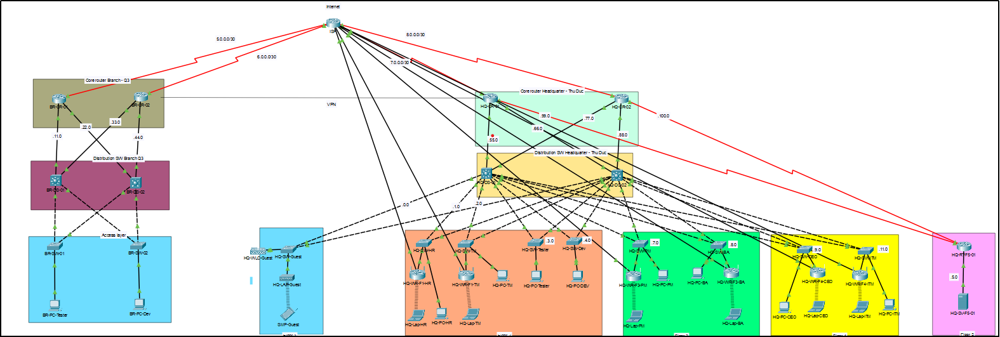

# **NT113_Network_Design**

## 1. Thành viên thực hiện
  + [TÔ CÔNG QUÂN](https://github.com/Zquan315)

## 2. Tổng quan
  * Đây là đồ án môn học **Thiết kế mạng - Design network - NT118**
  * **Tên đề tài:** Thiết kế hệ thống mạng công ty - Design a company network system
  * **Mục tiêu:** Xây dựng được một hệ thống mạng cho một công ty có hai trụ sở. Trụ sở chính được đặt tại Thủ Đức, TP. Hồ Chí Minh và một trụ sở phụ (chi nhánh) tại Quận 3, TP. Hồ Chí Minh.
  * **Tổng quan**: Công ty Outsource O-UIT có 1 trụ sở chính tại Thủ Đức và một chi nhánh tại Quận 3. Trụ sở chính là một tòa nhà 5 tầng gồm Data Center và các văn phòng làm việc dành cho CEO, HR, Project manager, Technical Manager, Business Analyst, IT manager và các nhóm developer và tester cho các project thuộc thị trường nước ngoài. Chi nhánh tại Quận 3 là văn phòng làm việc của các nhóm developer và tester cho các project thuộc thị trường trong nước.
  * **Các thông tin cơ bản về đề tài (yêu cầu khách hàng):**

| **Trụ sở chính**                         | **Chi nhánh**                                                             |
|------------------------------------|---------------------------------------------------------------------------|
| Developer và Tester chỉ được sử dụng máy bàn tại công ty, không được sử dụng laptop riêng để truy cập vào mạng của công ty. | Developer và Tester chỉ được sử dụng máy bàn tại công ty, không được sử dụng laptop riêng để truy cập vào mạng của công ty                         |
| CEO, HR, Project manager, Technical Manager, Business Analyst, IT manager được sử dụng Laptop, truy cập vào hệ thống wifi nội bộ sử dụng tài khoản xác thực.              | Sử dụng kết nối VPN site-to-site để deploy ứng dụng lên hệ thống tại Data Center                                                   |
| Một hệ thống wifi public với đường kết nối Internet riêng.                    | Một hệ thống wifi với đường kết nối Internet riêng                              |
| Hệ thống phần cứng để triển khai hệ thống server ảo phục vụ cho việc deploy các ứng dụng trong giai đoạn test.               |                       |
| Sử dụng các dịch vụ Cloud deploy các ứng dụng trong giai đoạn staging để khách hàng sử dụng thử trước khi đưa ra thực tế.             |                         |
                                                                          

## 3. Sơ đồ mạng Logic

## 4. Bảng địa chỉ

| **Số lượng thiết bị cần gán địa chỉ** | **Địa chỉ mạng con** | **Subnet Mask**        | **Số địa chỉ tối đa có thể dùng** | **Tên mạng con**          |
|:--------------------------------------|:---------------------|:-----------------------|:---------------------------------|:---------------------------|
| 100                                   | 192.168.0.0/24       | 255.255.255.0          | 254                               | HQ-Guest                   |
| 50                                    | 192.168.1.0/24       | 255.255.255.0          | 254                               | HQ-HR                      |
| 20                                    | 192.168.2.0/24       | 255.255.255.0          | 254                               | HQ-TM                      |
| 10                                    | 192.168.3.0/24       | 255.255.255.0          | 254                               | HQ-Tester                  |
| 10                                    | 192.168.4.0/24       | 255.255.254.0          | 254                               | HQ-Dev                     |
| 10                                    | 192.168.7.0/24       | 255.255.255.0          | 254                               | HQ-PM                      |
| 10                                    | 192.168.8.0/24       | 255.255.255.0          | 254                               | HQ-BA                      |
| 10                                    | 192.168.9.0/24       | 255.255.255.0          | 254                               | HQ-CEO                     |
| 10                                    | 192.168.11.0/24      | 255.255.254.0          | 254                               | HQ-ITM                     |
| 250                                   | 192.168.5.0/24       | 255.255.254.0          | 254                               | HQ-Floor5-Server           |
| 250                                   | 192.168.6.0/24       | 255.255.255.0          | 254                               | HQ-Floor5-WLC              |
| 20                                    | 192.168.10.0/24      | 255.255.255.0          | 254                               | Branch-Tester              |
| 20                                    | 192.168.20.0/24      | 255.255.255.0          | 254                               | Branch-Dev                 |
| 2                                    | 5.0.0.0/30           | 255.255.255.252        | 2                                 | WAN                        |
|  2                                      | 6.0.0.0/30           | 255.255.255.252        | 2                                 |   WAN                          |
|   2                                     | 7.0.0.0/30           | 255.255.255.252        | 2                                 |   WAN                          |
|    2                                    | 8.0.0.0/30           | 255.255.255.252        | 2                                 |   WAN                          |
|     2                                   | 192.168.99.0/30      | 255.255.255.252        | 2                                 |    WAN                         |
|      2                                  | 192.168.100.0/30     | 255.255.255.252        | 2                                 |    WAN                         |
|       2                                 | 50.0.0.0/30          | 255.255.255.252        | 2                                 |    WAN                         |
|        2                                | 60.0.0.0/30          | 255.255.255.252        | 2                                 |    WAN                         |
|         2                               | 70.0.0.0/30          | 255.255.255.252        | 2                                 |    WAN                         |
|          2                              | 80.0.0.0/30          | 255.255.255.252        | 2                                 |    WAN                         |
|           2                             | 90.0.0.0/30          | 255.255.255.252        | 2                                 |    WAN                         |
|            2                            | 100.0.0.0/30         | 255.255.255.252        | 2                                 |    WAN                         |
| 2                                   | 192.168.50.0/24      | 255.255.255.0          | 254                               | VPN                        |
|          2                             | 192.168.60.0/24      | 255.255.255.0          | 254                               |   VPN                          |
|           2                             | 192.168.70.0/24      | 255.255.255.0          | 254                               |      VPN                       |
|            2                            | 192.168.80.0/24      | 255.255.255.0          | 254                               |         VPN                    |

## 5. Kết luận
Đề án đã cho ta thấy kế hoạch chi tiết về việc thiết kế một hệ thống mạng cho một công ty có một trụ sở chính và một chi nhánh. Một số điểm nhấn quan trọng trong đề án này
* Mô hình mạng được thiết kế một cách linh hoạt và có tính bảo mật. Mô hình mạng được chia rõ ràng, việc sử dụng VPN để kết nối trụ sở và chi nhánh là hợp lý, vì việc nối dây nếu ở khoảng cách địa lý xa là bất khả thi. Các giao thức STP, HSRP nhằm đảm bảo hiệu suất, dự phòng và an toàn
* Việc thống kê và báo cáo chi tiết ngân sách là cần thiết cho việc quản lý, triển khai và duy trì được các dịch vụ mạng, tạo cơ sở để lập được kế hoạch tài chính một cách chi tiết, cụ thể và hợp lý
* Việc sử dụng các thiết bị định tuyến có chức năng quản lý tập trung như Multilayer Switch và WLC giúp dễ dàng quản lý và mở rộng hệ thống
> Một số lưu ý
* Tối ưu hóa chi phí: Cân nhắc các thiết bị và những dịch vụ được thuê để sử dụng các dịch vụ, thiết bị khác có chi phí thấp hơn nhưng chức năng tương tự
* Đánh giá hiệu năng thực tế: Mô phỏng trước mô hình mạng trước khi triển khai thực tế để đảm bảo hệ thống được hoạt động một cách trơn tru, vận hành ổn định nhất có thể
* Bảo trì: Cần xây dựng một kế hoạch bả trì định kỳ để giữ cho hệ thống luôn hoạt động ổn định, luôn ở trạng thái tốt nhất và sẵn sàng tại mọi thời điểm

> Chú ý về cấu hình ACL: 
*Hiện tại, việc cấu hình ACL chỉ đề các thiết bị của hai chi nhánh không kết nối, giao tiếp được với nhau. Các thiết bị ở chi nhánh chỉ giao tiếp được với server để thực hiện các thao tác trên đó. Bên cạnh đó, Guest chỉ được phép truy cập internet chứ không có quền giao tiếp với các thiết bị của công ty. Hiện tại, các thiết bị cùng chi nhánh làm việc có thể giao tiếp, nếu muốn thiết lập có thể cấu hình trên các Distribution Switch để thiết lập các quy tắc cho chúng.*

> ****Copyright by To Cong Quan**** 
